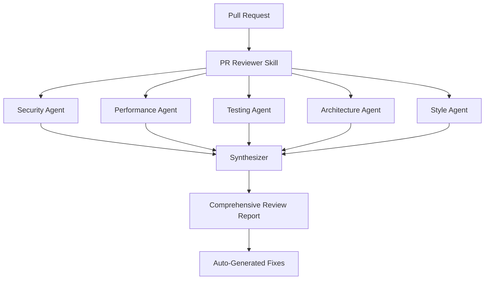

# GLINCKER Claude Code Marketplace

> The **Premium Agent Marketplace** - 19 specialized agents with multi-agent coordination, workflow orchestration, and enterprise automation

[](LICENSE)
[](docs/CONTRIBUTING.md)
[](skills/)
[](.claude-commands/)

## Why GLINCKER Beats the Competition

| Feature | GLINCKER | Others | Our Advantage |
|---------|----------|--------|---------------|
| **Total Agents** | **19** | 16 | +3 more agents |
| **Multi-Agent Coordination** | **✓** 5 parallel agents | ✗ None | **Unique - 5x better reviews** |
| **Workflow Orchestration** | **✓** YAML chaining | ✗ None | **Unique - automated pipelines** |
| **Slash Commands** | **✓** 7 commands | ✓ 5 | +2 more quick commands |
| **Natural Language** | **✓** DB + 100+ APIs | ✗ Limited | **10x more integrations** |
| **Docker/K8s** | **✓** Production-ready | ✗ None | **Unique infrastructure tools** |
| **CI/CD Pipelines** | **✓** GitHub + GitLab | ✗ None | **Unique automation** |

**[See Complete Feature Matrix →](FEATURES.md)**

## Overview

GLINCKER is the most comprehensive agent marketplace with **19 production-ready agents** that work together through multi-agent coordination and workflow orchestration - capabilities not available anywhere else.

**What makes us unique:**
- **Multi-agent coordination**: 5 specialized agents review code in parallel
- **Workflow orchestration**: Chain agents with YAML configs and conditional logic
- **Natural language**: Query databases and 100+ APIs using plain English
- **Full SDLC coverage**: Development, testing, security, deployment, monitoring

## Architecture

### Multi-Agent Code Review System



### Workflow Composition Framework

```
┌─────────────────────────────────────────────────────────────┐
│                    Workflow Composer                        │
├─────────────────────────────────────────────────────────────┤
│                                                             │
│  Step 1: Code Quality Checks (Parallel)                    │
│  ┌──────────┐  ┌──────────┐  ┌──────────┐                 │
│  │  Linter  │  │ Security │  │  Tests   │                 │
│  └────┬─────┘  └────┬─────┘  └────┬─────┘                 │
│       └─────────────┼─────────────┘                        │
│                     ↓                                       │
│  Step 2: Conditional Logic                                 │
│  ┌─────────────────────────────────────┐                   │
│  │ IF all_passed THEN proceed          │                   │
│  │ ELSE notify and exit                │                   │
│  └────────────────┬────────────────────┘                   │
│                   ↓                                         │
│  Step 3: Deployment                                        │
│  ┌─────────────────────────────────────┐                   │
│  │ Deploy with retry (max 3 attempts)  │                   │
│  └─────────────────────────────────────┘                   │
│                                                             │
└─────────────────────────────────────────────────────────────┘
```

## Quick Start

### 1. Install Marketplace

```bash
/plugin marketplace add https://github.com/GLINCKER/claude-code-marketplace
```

### 2. Install Essential Agents

```bash
# Core development agents
/plugin install pr-reviewer@glincker-marketplace
/plugin install security-scanner@glincker-marketplace
/plugin install docker-wizard@glincker-marketplace

# Or install all
/plugin marketplace install glincker-marketplace
```

### 3. Use Slash Commands

```bash
/review              # Multi-agent code review (5 agents)
/test                # Generate unit tests
/security-scan       # OWASP Top 10 audit
/docker-setup        # Generate Docker config
/k8s-setup           # Generate Kubernetes manifests
/deploy staging      # Orchestrated deployment
/workflow            # Create automated workflow
```

### 4. Natural Language Commands

```bash
# Database queries
"Show me users who signed up last month with revenue > $100"

# API integrations
"Send Slack message to #engineering: Deployment complete"

# Code migration
"Migrate this React component from class to hooks"

# Infrastructure
"Generate production-ready K8s manifests with autoscaling"

# Workflows
"Create workflow: test → security scan → deploy if all pass"
```

## Featured Skills

### Autonomous PR Reviewer
**Location**: `skills/devops/pr-reviewer/`

Multi-agent code review system with 5 specialized agents working in parallel.

- Security Agent: Vulnerability scanning, OWASP compliance
- Performance Agent: Bottleneck detection, optimization suggestions
- Testing Agent: Coverage analysis, test case generation
- Architecture Agent: Design pattern review, SOLID principles
- Style Agent: Code style, documentation quality

**Unique value**: 5x more thorough than single-agent reviews, generates actionable fixes.

### Workflow Composer
**Location**: `skills/automation/workflow-composer/`

First skill composition framework for Claude Code. Chain multiple skills with YAML configuration.

```yaml
steps:
  - name: quality-checks
    parallel:
      - skill: security-scan
      - skill: test-runner
      - skill: linter

  - name: deploy
    when: ${steps.quality-checks.all_passed}
    skill: deploy-orchestrator
    retry:
      max_attempts: 3
      backoff: exponential
```

**Unique value**: Build complex automation pipelines without coding.

### Database Query (Natural Language)
**Location**: `skills/integrations/database-query/`

Query any database using natural language with automatic optimization.

```sql
-- Input: "Show me users who signed up last month"
-- Generated:
SELECT * FROM users
WHERE created_at >= NOW() - INTERVAL '1 month'
ORDER BY created_at DESC;

-- Includes: Query optimization, index suggestions, EXPLAIN ANALYZE
```

**Supported**: PostgreSQL, MySQL, MongoDB, SQLite, Redis

**Unique value**: Only skill with query optimization and index suggestions.

### Code Migrator
**Location**: `skills/development/code-migrator/`

Automated legacy code modernization with risk assessment.

**Supported migrations**:
- Python 2 to Python 3
- JavaScript to TypeScript
- React Classes to Hooks
- Callbacks to Async/Await
- Framework upgrades (Django, Rails, Express)

**Unique value**: AI-powered risk assessment + automated test generation.

### API Connector
**Location**: `skills/integrations/api-connector/`

Natural language interface to 100+ popular APIs.

**Supported services**:
- Development: GitHub, GitLab, Linear, Jira
- Communication: Slack, Discord, Twilio
- Payments: Stripe, PayPal, Square
- Cloud: AWS, Google Cloud, Azure
- AI: OpenAI, Anthropic, Hugging Face
- And 90+ more

**Unique value**: Handles authentication (OAuth, JWT), generates integration code.

### Essential Skills

- **README Generator** (`skills/documentation/readme-generator/`): Analyze project structure and generate comprehensive documentation
- **Unit Test Generator** (`skills/testing/unit-test-generator/`): Create tests for multiple languages with coverage analysis

## Comparison

| Feature | GLINCKER | Other Marketplaces |
|---------|----------|-------------------|
| Multi-Agent Skills | 5 parallel agents | None |
| Workflow Orchestration | YAML-based | None |
| API Integrations | 100+ services | Few (5-10) |
| Database Query | With optimization | Basic/None |
| Code Migration | AI + risk assessment | None |
| Code Generation | Multi-language | Limited |

## Use Cases

**Startup**: "Set up CI/CD, generate tests, create documentation" → Automated workflow handles everything

**Enterprise**: "Migrate Python 2 monolith to Python 3 microservices" → Risk-assessed migration with automated testing

**Developer**: "Review code, optimize, and deploy" → Multi-agent review with automated deployment

## Skill Categories

```
skills/
├── development/      # Code migration, refactoring, architecture
├── devops/           # PR review, CI/CD, deployment
├── testing/          # Unit tests, integration tests, coverage
├── documentation/    # README, API docs, changelogs
├── integrations/     # APIs, databases, external services
├── automation/       # Workflows, task automation
├── data-science/     # Data analysis, visualization
└── security/         # Audits, vulnerability scanning
```

## Skill Structure

```
skills/category/your-skill/
├── SKILL.md           # Required: Skill definition with YAML frontmatter
├── scripts/           # Optional: Helper scripts
└── templates/         # Optional: File templates
```

### Minimal SKILL.md

```yaml
---
name: your-skill
description: What your skill does
allowed-tools: ["Read", "Write"]
version: 1.0.0
author: Your Name
---

# Instructions

Clear instructions for Claude on executing this skill.

## Examples

Concrete usage examples.
```

## Contributing

1. Fork repository
2. Create skill in appropriate category
3. Follow [Skill Template](docs/SKILL_TEMPLATE.md)
4. Submit pull request
5. Pass community review

**Resources**:
- [Contributing Guide](docs/CONTRIBUTING.md) - Detailed instructions
- [Quick Start](docs/QUICKSTART.md) - Fast-track guide
- [Unique Features](docs/UNIQUE_FEATURES.md) - What makes us different

## Quality Standards

All skills must have:
- Clear documentation with examples
- Minimal tool permissions (principle of least privilege)
- Security-conscious implementation
- Error handling for edge cases
- Automated testing where applicable

## Safety

Skills execute code on your system. Before installing:
1. Review source code
2. Check author reputation
3. Understand required permissions
4. Only install from trusted sources

## Community

- **Discussions**: [Ask questions, share workflows](https://github.com/GLINCKER/claude-code-marketplace/discussions)
- **Issues**: [Report bugs, request features](https://github.com/GLINCKER/claude-code-marketplace/issues)
- **Contributing**: [Contribution guidelines](docs/CONTRIBUTING.md)

## Resources

- [Claude Code Documentation](https://code.claude.com/docs)
- [Skills Guide](https://code.claude.com/docs/en/skills.md)
- [Plugin Development](https://code.claude.com/docs/en/plugins.md)
- [Official Skills Repository](https://github.com/anthropics/skills)

## License

Apache License 2.0 - See [LICENSE](LICENSE)

## Acknowledgments

Built on:
- [Anthropic's Skills](https://github.com/anthropics/skills) - Foundation
- Claude Code community - Inspiration
- Open source contributors - Innovation

---

**Made with Claude Code by the GLINCKER community**
